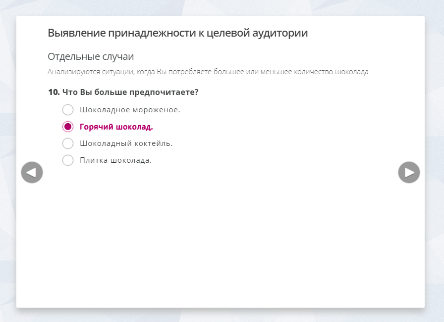
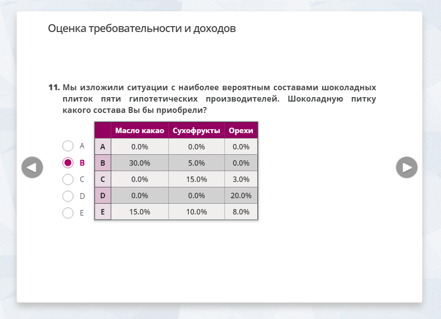

# Демонстративное приложение "Анкета" (Questionnaire)

## Назначение программы
Это веб-приложение для демонстрации анкеты, созданной с помощью AngularJS.

## Средства разработки
- **Среда разработки**: Sublime Text, Google Chrome, Mozilla Firefox.
- **Языки программирования**: JavaScript (ECMAScript 5), HTML 4 и 5, CSS2 и 3.
- **Внешние библиотеки**: AngularJS, AngularJS carousel (библиотека revolunet Julien Bouquillon для создания прокрутки в анкете).

## Описание программы
С помощью AngularJS carousel для анкеты реализовано три элемента "карусели" для тем вопросов, групп и самих вопросов: две с программным управлением, последняя - управляемая пользователем.

AngularJS формирует страницы с вопросами, синхронизирует их с данными из базы.
Используются директивы (directive) и отслеживание изменений данных с помощью $watch.

Большинство анимаций реализовано с помощью CSS3 Transitions (кроме одной, дл примера реализованной с помощью директивы).

## Статус проекта
Проект завершён.

## Контакты
Котова Екатерина Александровна,
e-mail: katekotova_86@mail.ru